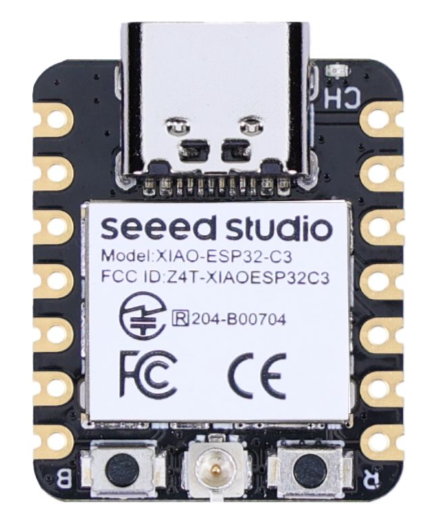
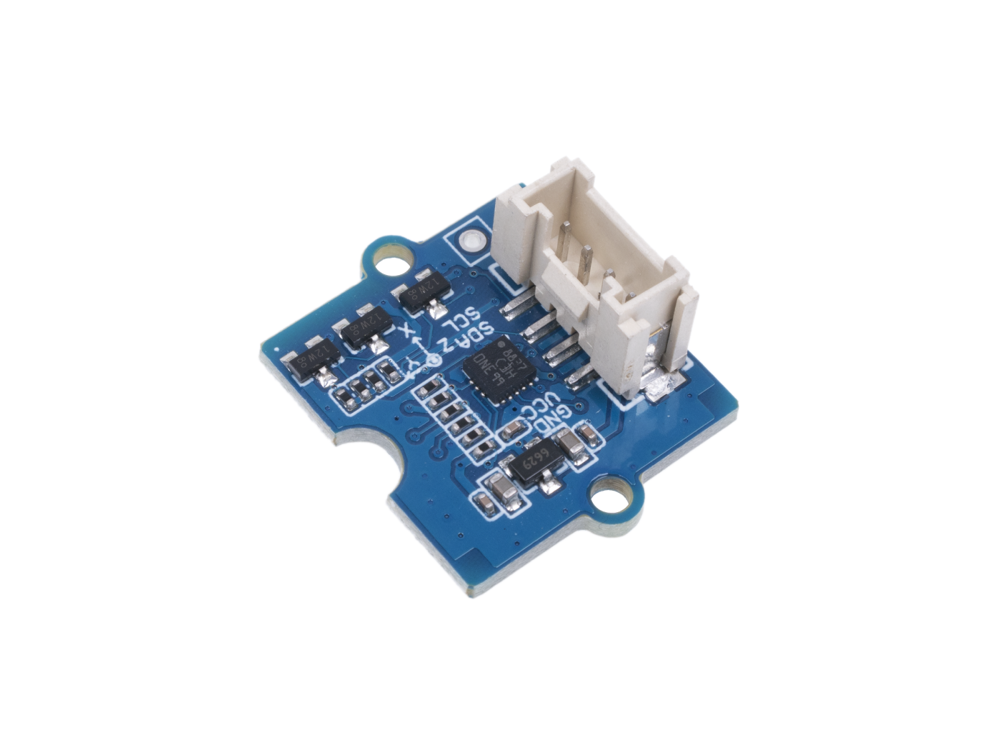

# Модуль умного ключа для распознавания кодового ритма
Модуль AI Rhythm Key

Как часто вы забывали ключ от дома или не могли его найти, когда собирались выходить? А может быть вы не знаете, куда деть ключ от вашего шкафчика в фитнес-центре, когда собираетесь в бассейн или сауну? А если шкафчик снабжён кодовым замком, переживали ли вы за то, что забудете комбинацию? Теперь не нужно запоминать цифры или носить ключ с собой – достаточно задать определенный ритмический рисунок, например из вашей любимой песни, для того чтобы замок открылся.

Давайте воспользуемся модулем умного ключа AI Rhythm Key с искусственным интеллектом для создания простого автоматического замка, который будет обучаться определенному стуку (ритмическому рисунку) вместо физического ключа.

Применение такого устройства широко, вот несколько примеров:

* Управление замком. Открытие двери в дом, комнату, гараж, как метод входа без ключа
* Ограничение доступа с помощью ритмического пароля к управлению устройствами умного дома (защита от детей): свет, вентилятор, кондиционер
* Доступ к автомобилю: секретки и кодовый ритм для запуска двигателя
* Ограничение доступа внутри офисных помещений
* Персональные шкафчики без физических ключей или запоминания цифровых комбинаций.

Видео работы устройства [ссылка появится позже]

## Подготовка
Нам потребуются следующие элементы:

**Модуль ключа на базе Seeed Studio XIAO ESP32C3**

 
Технические характеристики

**Микрофон INMP441**

 
Технические характеристики

**Динамик DXI30N-A**

 
Технические характеристики

**Усилитель класса D i2s MAX98357A**

 
Технические характеристики

**Плата расширения Grove Shield для XIAO с чипом управления батареей**

 
Технические характеристики

 * Встроенная функция для зарядки и контроля работы литиевого аккумулятора.
* Grove разъёмы (Grove IIC x 2, Grove UART x 1), всего выведено 14 GPIO.
* Компактный и легко разбирающийся дизайн.
* Выделена контактная площадка для Flash SPI.
* Встроенный переключатель питания и световой индикатор зарядки.
* Рабочее напряжение: 3,3В / 3,7В литиевого аккумулятора.
* Электрическая ёмкость: 800мA.
* Питание зарядки 400мA (макс).

**Трёхосевой цифровой акселерометр Grove (LIS3DHTR)**

 
Технические характеристики

* Питание: 3/5 В.
* Полный диапазон динамически выбираемых параметров ±2g/±4g/±8g/±16g.
* Цифровой выходной интерфейс I2C/SPI/АЦП.
* 16-битный вывод данных.
* 2 независимых программируемых генератора прерываний для определения движения и свободного падения.
* Определение ориентации в 6D/4D.
* Распознавание свободного падения.
* Распознавание движения.
* Встроенный температурный датчик.
* Востренный механизм самопроверки.
* Встроенные 32 уровня 16-битного вывода данных FIFO.

**Кнопка Grove**

 
Технические характеристики

 •	Рабочее напряжение: 3,3/5В
 
•	Ресурс: 200 000 циклов

•	Усилие нажатия: 100 ± 50gf

•	Рабочая температура: -25℃ до +70℃

•	Габариты: 20ммX20мм.

**Универсальные 20см кабели Grove - с 4-мя контактами**

**Переходные кабели Grove с четырьмя контактами и женским разъёмом типа джампер**

