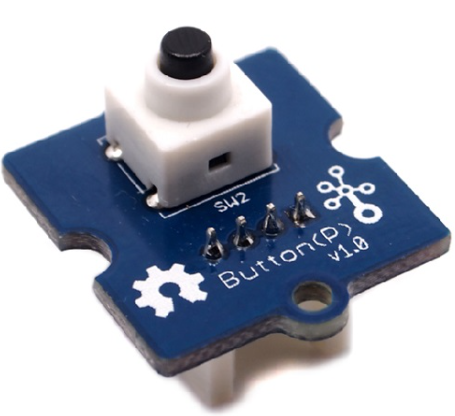

# Модуль умного ключа для распознавания кодового ритма
Модуль AI Rhythm Key

Как часто вы забывали ключ от дома или не могли его найти, когда собирались выходить? А может быть вы не знаете, куда деть ключ от вашего шкафчика в фитнес-центре, когда собираетесь в бассейн или сауну? А если шкафчик снабжён кодовым замком, переживали ли вы за то, что забудете комбинацию? Теперь не нужно запоминать цифры или носить ключ с собой – достаточно задать определенный ритмический рисунок, например из вашей любимой песни, для того чтобы замок открылся.

Давайте воспользуемся модулем умного ключа AI Rhythm Key с искусственным интеллектом для создания простого автоматического замка, который будет обучаться определенному стуку (ритмическому рисунку) вместо физического ключа.

Применение такого устройства широко, вот несколько примеров:

* Управление замком. Открытие двери в дом, комнату, гараж, как метод входа без ключа
* Ограничение доступа с помощью ритмического пароля к управлению устройствами умного дома (защита от детей): свет, вентилятор, кондиционер
* Доступ к автомобилю: секретки и кодовый ритм для запуска двигателя
* Ограничение доступа внутри офисных помещений
* Персональные шкафчики без физических ключей или запоминания цифровых комбинаций.

Видео работы устройства [ссылка появится позже]

## Подготовка
Нам потребуются следующие элементы:

**Модуль ключа на базе Seeed Studio XIAO ESP32C3**

 
Технические характеристики

 
* Процессор: ESP32-C3 SoC. 32-битный одноядерный процессор RISC-V с четырехступенчатым конвейером, который работает на частоте до 160 МГц.
* Беспроводной модуль: полная подсистема Wi-Fi 2,4 Гц. Bluetooth 5.0/ Bluetooth mesh.
* Встроенная память: SRAM-память - 400 Кб, флэш-память - 4Мб.
* Интерфейсы: 1x UART, 1x IIC, 1x SPI,11x GPIO (ШИМ), 4x АЦП. 1x кнопка Reset , 1x кнопка Boot.
* Размеры: 21 x 17,5 мм.
* Питание: рабочее напражение сети: 3.3В@200мA.
* Питание зарядки: 50мA/100мA.
* Напряжение на входе (VIN): 5В.
* Потребление питания в спящем режиме: Спящий режим >44 μА.
* Потребление питания при включённом Wi-Fi: Активный режим: <75 мA.
* Спящий режим модема: <25 мA.
* Режим неглубокого сна: <4 мA.
* Потребление питания при включённом BLE: Спящий режим модема: <27 мA.
* Режим неглубокого сна: <10 мA.
* Рабочая температура: -40°C ~ 85°C.

**Микрофон INMP441**

 
Технические характеристики

 
* Цифровой интерфейс I²S с высокоточным 24-битными данными.
* Высокое ОСШ: от 61 дБА.
* Высокая чувствительность: от -26 dBFS.
* Плоская частотная характеристика от 60 Гц до15 кГц.
* Низкое энергопотребление: 1.4 мА.
* Высокий PSR: −75 dBFS.
* Малые габариты: 4.72 мм × 3.76 мм × 1 мм.
* Пригоден для пайки с оловянно-свинцовым припоем и припоем без свинца.
* Соответствие стандартам RoHS/WEEE.

**Динамик DXI30N-A**

 
Технические характеристики

* Эффективный рабочий диапазон частот 200-8000 Гц.
* Предельная мощность: шумовая - 0,5 Вт, пиковая - 1,5 Вт.
* Номинальное электрическое сопротивление (импеданс), Ω 8 Ом.
* Уровень характеристической чувствительности 85±3 дБ.
* Неравномерность АЧХ 18 дБ.
* Габаритные размеры Ø30х4,8 мм.

**Усилитель класса D i2s MAX98357A**

 
Технические характеристики

* Выходная мощность: 3,2 Вт при4 Ω, 10% КНИ, 1,8 Вт при 8Ω, 10% КНИ, с обеспечением в 5 В.
* PSRR: 77 дБ тип @ 1 КГц.
* Частота дискретизации I2Sот 8кГц до 96кГц.
* MCLK не требуется.
* Уменьшение лишних шумов.
* Пять коэффициентов усиления на выбор: 3дБ, 6 дБ, 9 дБ, 12 дБ, 15 дБ.
* Отличная система подавления щелчков и хлопков.
* Защита от перегрева

**Плата расширения Grove Shield для XIAO с чипом управления батареей**

 
Технические характеристики

* Встроенная функция для зарядки и контроля работы литиевого аккумулятора.
* Grove разъёмы (Grove IIC x 2, Grove UART x 1), всего выведено 14 GPIO.
* Компактный и легко разбирающийся дизайн.
* Выделена контактная площадка для Flash SPI.
* Встроенный переключатель питания и световой индикатор зарядки.
* Рабочее напряжение: 3,3В / 3,7В литиевого аккумулятора.
* Электрическая ёмкость: 800мA.
* Питание зарядки 400мA (макс).

**Трёхосевой цифровой акселерометр Grove (LIS3DHTR)**

 
Технические характеристики

* Питание: 3/5 В.
* Полный диапазон динамически выбираемых параметров ±2g/±4g/±8g/±16g.
* Цифровой выходной интерфейс I2C/SPI/АЦП.
* 16-битный вывод данных.
* 2 независимых программируемых генератора прерываний для определения движения и свободного падения.
* Определение ориентации в 6D/4D.
* Распознавание свободного падения.
* Распознавание движения.
* Встроенный температурный датчик.
* Востренный механизм самопроверки.
* Встроенные 32 уровня 16-битного вывода данных FIFO.

**Кнопка Grove**

 
Технические характеристики

* Рабочее напряжение: 3,3/5В.
* Ресурс: 200 000 циклов.
* Усилие нажатия: 100 ± 50gf.
* Рабочая температура: -25℃ до +70℃.
* Габариты: 20ммX20мм.

**Универсальные 20см кабели Grove - с 4-мя контактами**

**Переходные кабели Grove с четырьмя контактами и женским разъёмом типа джампер**

## Схема подключения

Так выглядит макет устройства для управления замком с помощью ритма и с использованием голосового управления.

Для простой сборки макета устройства мы можете использовать плату расширения Grove Shield:

Или можно обойтись без платы, подключая оборудование непосредственно к ножкам модуля:

Схема какая ножка модуля за что отвечает:

Switcher out - ножка, на которую будет подаваться сигнал при разблокировке замка (на 3 сек). К этой ножке может быть подключено пользовательское устройство, которое будет управлять замком.

## Принцип работы
Основа устройства - модуль распознавания ритма, который разработан на базе чипа Seeed Studio XIAO ESP32C3. 
Это миниатюрная плата с 32-bit RISC-V процессором, работающим на скорости 160 МГц, имеющая 400 KB SRAM и 4 MB Flash-памяти.
Чип уже прошит, на нём находится программное обеспечение необходимое для работы, в том числе рекуррентная нейронная сеть, отвечающая за распознавание ритма. 
В отличие от общераспространенных свёрточных нейросетей, для рекуррентной сети вам не нужен огромный датасет, чтобы научить устройство распознавать ваш ритм – оно запоминает ритмический рисунок с первого раза. А в дальнейшем вам не нужно воспроизводить его максимально идентично, с точностью до миллисекунд – устройство, как человек, поймет, является ритм тем же самым или нет, даже если там будут небольшие отклонения. 
Общая блок-схема работы устройства и пояснения приведены ниже.

###  Режим обучения

При первом включении и после перезагрузки устройство готово запомнить ритм, который вводит пользователь. При появлении запроса «Are you ready to learn?» («Вы готовы к обучению?» скажите «YES» («Да») или нажмите кнопку «USER», дождитесь команды ”Go!” и простучите свой ритм. После этого устройство перейдет в режим распознавания.

### Режим распознавания

После перехода в режим распознавания устройство спрашивает «Are you ready to tap?» («Вы готовы простучать ритм?») Скажите «Yes» или нажмите кнопку USER, дождитесь команды “Go!“ и простучите свой ритм. Устройство "прослушивает" входящий ритм и определяет, совпадает ли он с установленным. Если ритм совпал, то устройство сообщает «OK! The door is unlocked» и отправляет сигнал на открытие двери (switcher out – GPIO21, в течение 3 секунд). После этого устройство переходит в спящий режим.
В случае, если ритм не совпал, устройство ещё раз попросит вас его простучать. 

### Режим ожидания

Устройство попадает в спящий режим после успешного распознавания ритма или после периода бездействия более 1 минуты. 
Для вывода устройство из спящего режима и перехода к распознаванию или обучению скажите «Sheila». 
